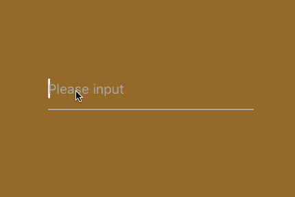

# YJTextField 




Easy to use! Inspired by one code in the internet ( forget the source ).

```swift
let tf = YJTextField()
tf.frame = CGRectMake(0, 0, 200, 40)
tf.placeholder = "Please input"
tf.center = view.center
tf.placeholderSelectColor = UIColor.whiteColor()
view.addSubview(tf)
```

